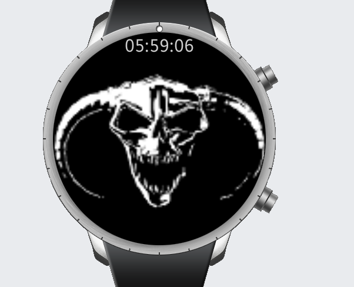

MohFace
=======

This is just a random app to create a new app for my gadget.

It looks like this:

References
----------

* https://developer.samsung.com/gear/develop/creating-your-first-app/native-watch-face
* https://developer.tizen.org/development/training/native-application/application-development-process
* https://developer.tizen.org/development/api-references/native-application?redirect=/dev-guide/latest/org.tizen.native.wearable.apireference/group__CAPI__WATCH__APP__MODULE.html
* https://developer.tizen.org/ko/development/training/web-application/getting-started/creating-your-first-tizen-wearable-web-watch-application?langredirect=1
* https://developer.tizen.org/ko/forums/native-application-development/adding-background-image-box?langswitch=ko
* https://developer.tizen.org/ko/development/guides/native-application/user-interface/efl/building-ui-layouts/box?langredirect=1
* https://developer.tizen.org/dev-guide/2.4/org.tizen.tutorials/html/native/graphics/graphic_comp_tutorial_n.htm
* https://developer.tizen.org/ko/development/sample/native/Graphics/Cairo_Basic
* https://developer.tizen.org/development/tizen-studio/native-tools/managing-projects/certificate-registration
